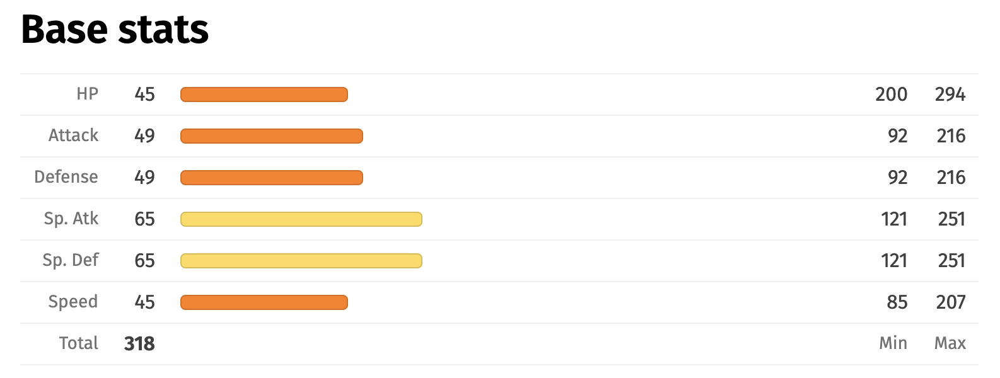

# Week 1

### Instructions:

- clone the repo
- `cd web_dev_lessons/week1`
- `open index.html`

### Goals:

- Understand where JS/CSS/HTML lives in an HTML document and how they interact
  - Why is CSS at the top and JS at the bottom?
- Understand how to write basic CSS/HTML and achieve basic layouts
- Understand how to use `fetch` to get data from an API
- Understand how to manipulate and listen to the DOM with JS
  - How do you identify and select DOM elements with `document.querySelector`
  - How do you listen to DOM events and what are some basic DOM events `document.addEventListener`
    - click
    - submit
    - focus
  - How do you set the text content of a DOM element `Element.textContent`
  - How do you set the HTML content of a DOM element `Element.appendChild`
- Play around with new features on Pokedex
  - Ideas:
    - Show the pokemon's types
    - Show the pokemon's abilities
    - Show the pokemon's moves
    - Improve the stats so that they show as bars 
    - Show the pokemon's weaknesses/strengths
    - Make things look prettier 🦄
